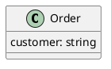
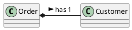
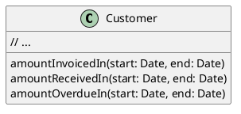
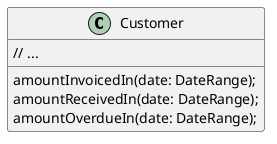
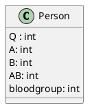
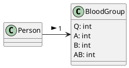
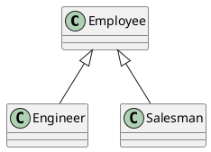
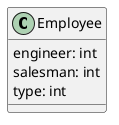

# Primitive Obsession

Use of primitives instead of small objects for simple tasks (such as currency, ranges, special strings for phone numbers, etc)
Use of constants for coding information (such as a constant **USER_ADMIN = 1** for referring to users with administrator rights.)
Use of string constants as field names for use in data arrays.

**Reasons for the Problem**
Like most other smells, primitive obsessions are born in moments of weakness. "Just a field for storing some data!" the programmer said.
Creating a primitive field is so much easier than making a whole new class, right? And so it was done. Then another field was needed and added in the same way. Lo and behold, the class became huge and unwieldly.

Primitives are often used to "simulate" types. So instead of a separate data type, you have a set of numbers or string that form the list of allowable values for some entity. Easy-to-understand names are then given to these specific numbers and strings via constants, which is why they're spread wide and far.

Another example of poor primitive use is field simulation. The class contains a large array of diverse data and string constants (which are specified in the class) are used as array indicies for getting this data.

**Treatment**

# Recipe #1: Replace Set of Fields with Object

If you have a large variety of primitive fields, it may be possible to logically group some of them into their own class. Even better, move the behavior associated with this data into the class too. For this task, try **Replace Data Value with Object**.

**Replace Data Value with Object**

## :x: Problem

A class (or group of classes) contains a data field. The field has its own behavior and associated data.



```c++
class Order {
    private:
        string customer;
    public:
        // ...
};
```

## :heavy_check_mark: Solution





```c++
class Customer {

};
class Order {
    private:
        Customer* c;
    public:
        Order() {
            c = new Customer();
        }
}
```


# Recipe #2: Primitive Fields in Method Parameters
If the values of primitive fields are used in method parameters, go with **Introduce Parameter Object** or **Preserve Whole Object**.

* **Introduce Parameter Object**

## :x: Problem
Your methods contain a repeating group of paramters.


```c++
class Customer {
    private:
        // ...
    public:
        amountInvoicedIn(Date start, Date end);
        amountReceivedIn(Date start, Date end);
        amountOverdueIn(Date start, Date end);
}
```

## :heavy_check_mark: Solution
Replace these parameters with an object.


```c++
class Customer {
    private:
        // ...
    public:
        amountInvoicedIn(DateRange date);
        amountReceivedIn(DateRange date);
        amountOverdueIn(DateRange date);  
};
```

* **Preserve Whole Object**

## :x: Problem
You get several values from an object and then pass them as parameters to a method.

```c++
int low = daysTempRange.getLow();
int high = daysTempRange.getHigh();
bool withinPlan = plan.withinRange(low, high);
```

## :heavy_check_mark: Solution
Instead, try passing the whole object.

```c++
bool withinPlan = plan.withinRange(daysTempRange);
```

# Recipe #3: Get Rid of Type Codes
When complicated data is coded in variables, use **Replace Type Code with Class**, **Replace Type Code with Subclasses** or **Replace Type Code with State/Strategy**.

* **Replace Type Code with Class**

## :x: Problem
A class has a field that contains type code. The values of this type aren't used in operator conditions and don't effect the behavior of the program.



```c++
class Person {
    int Q;
    int A;
    int B;
    int AB;
    int bloodgroup;
}
```

## :heavy_check_mark: Solution
Create a new class and use its objects instead of the type code values.




```c++
class BloodGroup
{
    private:
        int Q;
        int A;
        int B;
        int AB;
    public:
        // ...
};
class Person 
{
    BloodGroup* bloodgroup; // aggregation/assoication
    Person(BloodGroup* bg): bloodgroup{bg} {}
};
```


* **Replace Type Code with Subclasses**

## :x: Problem
You have a coded type that directly affects program behavior (values of this field trigger various code in conditionals).

```plantuml
class Employee {
    ENGINEER: int
    SALESMAN: int
    type: int
}
```

```c++
class Employee 
{
    int ENGINEER;
    int SALESMAN;
    int type;
};
```

## :heavy_check_mark: Solution
Create subclasses for each value of the coded type. Then extract the relevant behaviors from the original class to these subclasses. Replace the control flow code with polymorphism.



```c++
class Employee {

};
class Engineer: public Employee {

}
class Salesman: public Salesman {

}
```

* **Replace Type Code with State/Strategy**

## :x: Problem
You have a coded type that affects behavior but you can't use subclasses to get rid of it.



## :heavy_check_mark: Solution
Replace type code with a state object. If it's necessary to replace a field value with type code, another state object is "plugged in".


```plantuml
Employee -> EmployeeType: 1 >
EmployeeType <|-- Engineer
EmployeeType <|-- Salesman
```


```c++
class EmployeeType {}
class Engineer: public EmployeeType {}
class Salesman: public EmployeeType {}
class Employee {
    public:
        void work(EmployeeType* type) {

        }
}
```

# Recipe #4: Replace Array with Object
If there are arrays among the variables, use **Replace Array with Object**.


## :x: Problem
You have an array that contains various types of data.

```c++
string row[2];
row[0] = "Liverpool";
row[1] = "15"; 
```

## :heavy_check_mark: Solution
Replace the array with an object that will have separate fields for each element.

```c++
Performance row = new Performance();
row.setName("Liverpool");
row.setWins("15");
```


# Payoff

:heavy_check_mark: Code becomes more flexible thanks to use of objects instead of primitives.
:heavy_check_mark: Better understandability and organization of code. Operations on particular data are in the same place, instead of being scattered. No more guessing about the reason for all these strange constants and why they're in an array.
:heavy_check_mark: Easier finding duplicate code.